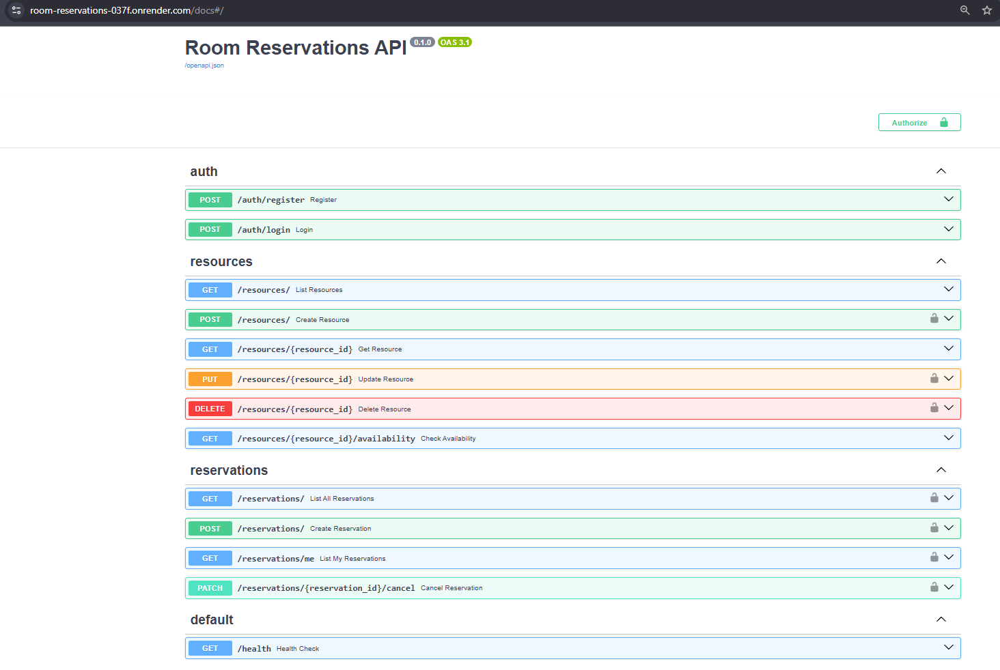

# Room Reservations API

Sistema de reservas de salas de estudo, construído com FastAPI, PostgreSQL e autenticação JWT. Permite que usuários consultem disponibilidade de salas e façam reservas, com bloqueio automático de conflitos de horário.
```text
🔗 **API em produção**: https://room-reservations-037f.onrender.com
📄 **Documentação interativa (Swagger)**: https://room-reservations-037f.onrender.com/docs
```
---

## Arquitetura

```text
room-reservations/
├── app/
│   ├── core/          # Configurações, conexão com banco, segurança (JWT/hash)
│   ├── models/        # Modelos SQLAlchemy (User, Resource, Reservation)
│   ├── schemas/       # Schemas Pydantic (validação de entrada/saída)
│   ├── routers/       # Rotas da API (auth, resources, reservations)
│   ├── tests/         # Testes automatizados (pytest)
│   └── main.py        # Ponto de entrada da aplicação
├── alembic/           # Migrations do banco de dados
├── Dockerfile
├── docker-compose.yml
└── requirements.txt
```

### Stack

- **FastAPI** — framework web assíncrono
- **PostgreSQL** — banco de dados relacional
- **SQLAlchemy** — ORM
- **Alembic** — versionamento de schema do banco
- **JWT (python-jose)** — autenticação por token
- **Passlib + bcrypt** — hash de senhas
- **pytest** — testes automatizados
- **Docker / Docker Compose** — containerização
- **Render** — deploy em produção

### Modelo de dados

- **User**: `id`, `nome`, `email`, `senha_hash`, `role` (`cliente` ou `admin`)
- **Resource**: `id`, `nome`, `capacidade`, `descricao`
- **Reservation**: `id`, `user_id`, `resource_id`, `data_inicio`, `data_fim`, `status` (`confirmada` ou `cancelada`)

### Regras de negócio principais

- Apenas usuários com `role = admin` podem criar, editar ou remover recursos (salas).
- Qualquer usuário autenticado pode consultar disponibilidade e criar reservas.
- O sistema bloqueia automaticamente reservas com sobreposição de horário no mesmo recurso (retorna `409 Conflict`).
- Uma reserva só pode ser cancelada pelo próprio usuário que a criou ou por um admin.
- Cancelamento é um "soft delete" — a reserva permanece no banco com `status = cancelada`, preservando histórico.

---

## Endpoints

### Autenticação (`/auth`)

| Método | Rota | Descrição | Autenticação |
|---|---|---|---|
| POST | `/auth/register` | Cria um novo usuário | Não |
| POST | `/auth/login` | Autentica e retorna um token JWT | Não |

### Recursos (`/resources`)

| Método | Rota | Descrição | Autenticação |
|---|---|---|---|
| POST | `/resources/` | Cria um novo recurso | Admin |
| GET | `/resources/` | Lista todos os recursos | Não |
| GET | `/resources/{id}` | Detalha um recurso | Não |
| PUT | `/resources/{id}` | Atualiza um recurso | Admin |
| DELETE | `/resources/{id}` | Remove um recurso | Admin |
| GET | `/resources/{id}/availability` | Verifica disponibilidade num intervalo | Não |

### Reservas (`/reservations`)

| Método | Rota | Descrição | Autenticação |
|---|---|---|---|
| POST | `/reservations/` | Cria uma nova reserva | Usuário |
| GET | `/reservations/me` | Lista as reservas do usuário logado | Usuário |
| GET | `/reservations/` | Lista todas as reservas | Admin |
| PATCH | `/reservations/{id}/cancel` | Cancela uma reserva | Dono ou Admin |

Documentação completa e interativa disponível em [`/docs`](https://room-reservations-037f.onrender.com/docs).

---

## Instalação local

### Pré-requisitos
- Python 3.11+
- PostgreSQL rodando localmente (ou via Docker, veja abaixo)

### Passos

```bash
# Clone o repositório
git clone https://github.com/G6uni1/room-reservations.git
cd room-reservations

# Crie e ative o ambiente virtual
python -m venv venv
venv\Scripts\activate       # Windows
source venv/bin/activate    # Linux/Mac

# Instale as dependências
pip install -r requirements.txt

# Configure o .env (copie o .env.example e ajuste os valores)
cp .env.example .env

# Rode as migrations
alembic upgrade head

# Suba a API
uvicorn app.main:app --reload
```

A API estará disponível em `http://localhost:8000`, com Swagger em `http://localhost:8000/docs`.

### Rodando os testes

```bash
pytest app/tests/ -v
```

---

## Instalação via Docker

### Pré-requisitos
- Docker Desktop instalado e rodando

### Passos

```bash
# Configure o .env na raiz do projeto com as variáveis do Postgres
# (POSTGRES_USER, POSTGRES_PASSWORD, POSTGRES_DB, SECRET_KEY, etc.)

# Suba os containers
docker-compose up --build

# Em outro terminal, rode as migrations
docker-compose exec api alembic upgrade head
```

A API estará disponível em `http://localhost:8000`.

---

## Deploy

O projeto está publicado na [Render](https://render.com), com:
- **Web Service** rodando via Docker (build automático a partir do `Dockerfile`)
- **PostgreSQL** gerenciado pela Render
- Migrations executadas automaticamente a cada deploy via Start Command

---

## Screenshots

*(Swagger UI da API em produção)*




---

## Autor

Desenvolvido por [G6uni1](https://github.com/G6uni1) como projeto de estudo em backend com FastAPI.
